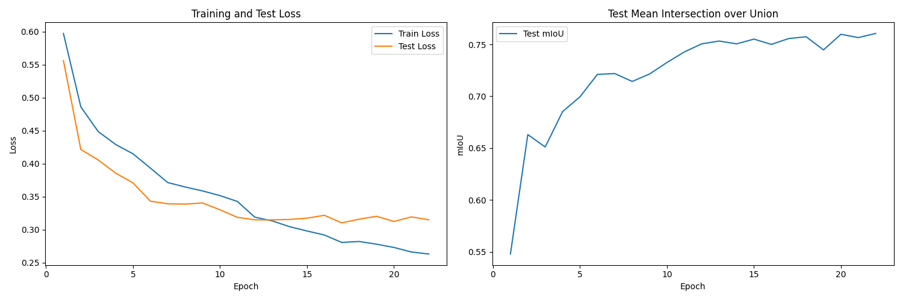
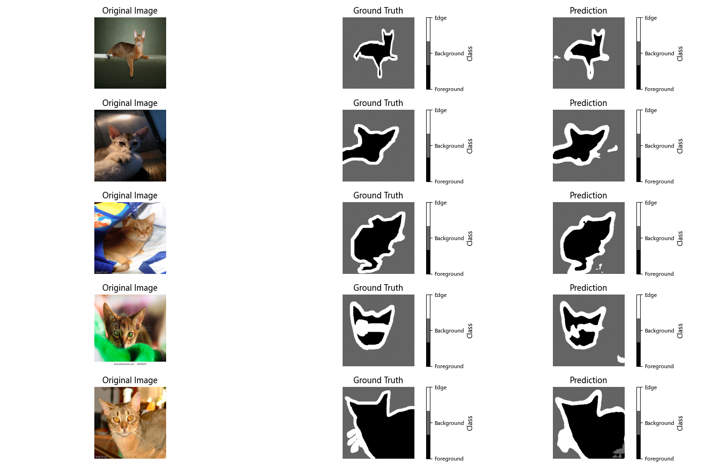

# 图像分割项目 - 带注意力机制的U-Net模型

## 项目简介

本项目实现了一个基于深度学习的图像分割系统，使用带有注意力机制的U-Net模型来执行精确的图像分割任务。该模型特别适合于对犬类图像进行实例分割，支持对boxer和pug等犬种的精确分割。

## 项目结构

```
├── main.py             # 主函数，包含模型的训练和保存
├── model.py            # 模型定义，包含带注意力机制的U-Net实现
├── config.py           # 配置文件，包含训练参数和路径设置
├── utility_function.py # 工具函数定义
├── visualize_segmentation.py    # 对模型进行评估和可视化
├── requirements.txt    # 项目依赖
├── images/             # 训练和测试图像数据
├── annotations/        # 标注文件
│   ├── xmls/           # XML格式的标注
│   ├── trimaps/        # 分割掩码
├── best_model.pth      # 训练好的最佳模型
└── class_weights.json  # 保存的类别权重文件
```

## 模型架构

本项目实现了带注意力机制的U-Net模型，主要特点包括：

1. **编码器-解码器结构**：
   - 编码器部分通过卷积和池化操作逐渐降低特征图分辨率
   - 解码器部分通过转置卷积和跳跃连接恢复空间分辨率

2. **注意力门控机制**：
   - 在跳跃连接中引入注意力门控，使模型能够关注重要区域
   - 提高了模型对边界和细节的分割精度

3. **残差连接**：
   - 在卷积块中使用残差连接，有助于缓解梯度消失问题

模型的主要组件：
- `AttentionGate`：实现注意力机制的门控单元
- `UNet`：主模型类，包含完整的U-Net架构
- `conv_block`：基本卷积块，包含卷积、批归一化和激活函数

## 安装指南

### 1. 克隆项目（如适用）

```bash
git clone https://github.com/Masalto5835/U-Net_ImageSegmentation.git
```

### 2. 创建虚拟环境

```bash
# 使用Python创建虚拟环境
python -m venv .venv

# 激活虚拟环境
# Windows
.venv\Scripts\activate
# Linux/Mac
source .venv/bin/activate
```

### 3. 安装依赖

```bash
pip install -r requirements.txt
```

## 使用方法

### 1. 准备数据

- 将图像数据放置在`images/`目录下
- 确保分割掩码位于`annotations/trimaps/`目录下（格式需与config.py中设置一致）

### 2. 配置训练参数

编辑`config.py`文件，根据需要调整以下参数：

```python
# 训练配置示例
self.batch_size = 16    # 批次大小
self.img_size   = 256   # 输入图像尺寸
self.num_epochs = 100   # 训练轮数
self.lr         = 0.001 # 学习率
```

## 技术细节
### 损失曲线


### 示例验证


### 核心依赖

- **PyTorch**：深度学习框架
- **Torchvision**：计算机视觉工具库
- **OpenCV**：图像处理库
- **NumPy**：数值计算库
- **Matplotlib**：可视化库
- **scikit-learn**：机器学习工具库

### 模型特点

1. **注意力机制**：在编码器和解码器之间的跳跃连接中加入注意力门控，提高分割精度
2. **动态输出通道**：支持根据任务需求设置不同的输出通道数
3. **自动保存模型结构**：初始化时自动保存模型结构到本地文件
4. **模块化设计**：代码结构清晰，便于扩展和修改

## 注意事项

1. 项目中的`mask_dir`路径需要用户根据实际情况修改和准备数据
2. 当前版本没有提供完整的训练和推理脚本，需要用户进一步开发
3. 模型训练需要支持CUDA的GPU环境以提高训练效率

## 扩展建议

1. 添加数据预处理和增强功能
2. 实现完整的训练和评估脚本
3. 添加模型推理和可视化功能
4. 尝试不同的优化器和学习率调度策略
5. 实现模型量化和部署功能

## 更新日志

- 初始版本：实现带注意力机制的U-Net模型